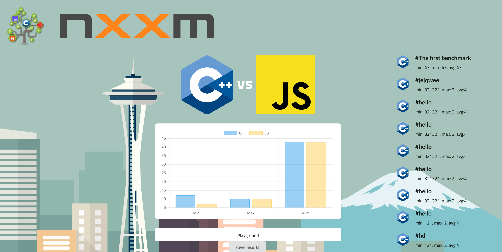

# bete: C++ Webserver running on WebAssembly

* `bete::server` : WebAssembly webserver
* `bete::websocket::server` : WebSocket server for browser &amp; NodeJS
* `bete::websocket::client` : WebSocket client for browser &amp; NodeJS
* `bete::remote_observable` : Export a C++ Datatype on the web.

This is part of the [bellevue set of libraries](https://github.com/nxxm/bellevue)



## How to use it ? 

This will setup all your dependencies : `nxxm . -x node_modules` .

We are pretty young, please reach out to us at damien.buhl@lecbna.org or via the [nxxm mailing list](https://groups.google.com/forum/#!forum/nxxm).
For examples please refer here : [Client Code](https://github.com/nxxm/bete/blob/master/index.html#L386)

## License
This project is licensed under the permissive MIT License, this is done to encourage you to contribute and make the next generation of Web Apps in WebAssembly together.

[MIT License](./LICENSE.md), please just reproduce copyrights :

```
Copyright (c) 2018 - present nxxm.io
```
